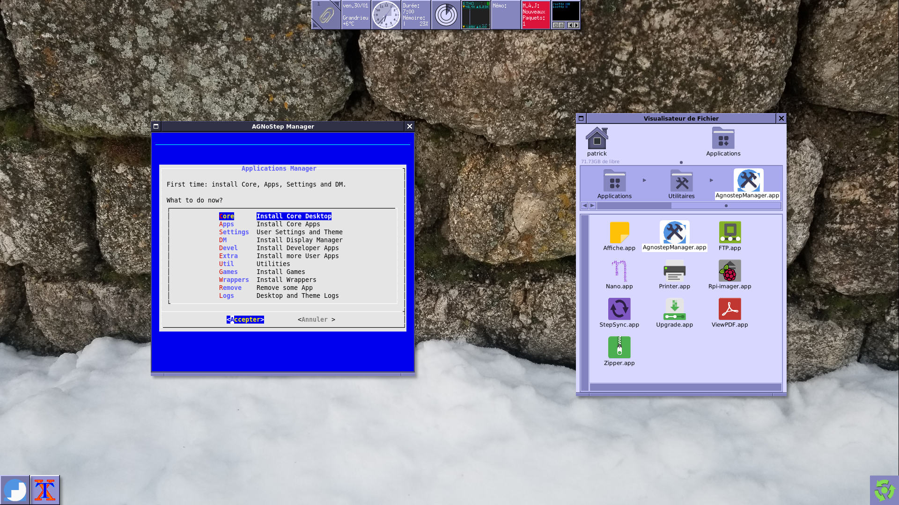
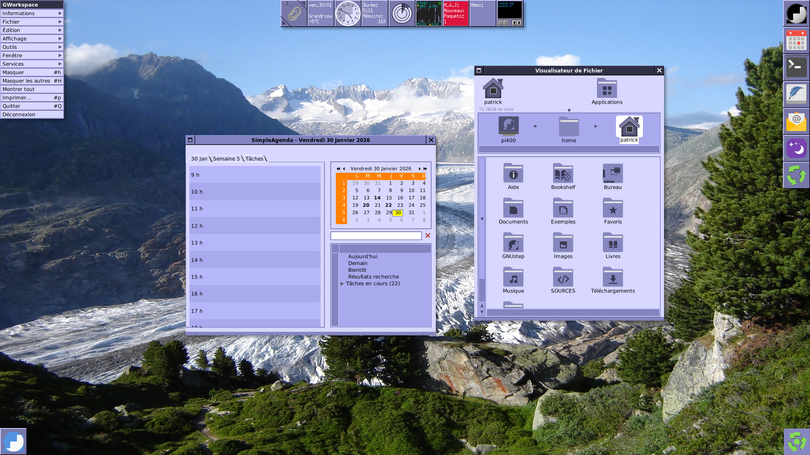

# AGNoStep: an Agnostic GNUstep Desktop for All

Read [RELEASE](Documentation/RELEASE.md) to know the current status.

## The Goal

AGNoStep project tries to provide a way to install a GNUstep compliant Desktop with ease.
It provides also a **new** in purpose **Theme** mainly inspired by the [Papirus](https://github.com/PapirusDevelopmentTeam/papirus-icon-theme) iconset: see [AGNOSTEP-theme](https://github.com/pcardona34/agnostep-theme).

It is provided under the [GNU Public License](LICENSE.txt).

## What is a GNUstep compliant Desktop

- GNUstep is a free, open-source development environment that provides a **framework** for building cross-platform applications using the **Objective-C** programming language: see [GNUstep.org](https://www.gnustep.org). 
- So a compliant GNUstep system must be set on the top of a **complete GNUstep System**.  
Thanks to this framework, we can build all the pieces of software together to provide the User experience. 

Namely, the Core Desktop provides:

- A complete [Workspace](http://toastytech.com/guis/openstep.html) inherited from the famous NeXT/OPENSTEP specifications.
- A set of useful **applications**: contacts, agenda, mail user agent, Text editor, Terminal...  
See [CORE_DESKTOP](Documentation/CORE_DESKTOP.md) for details and technical notes.

## What does mean an Agnostic GNUstep Desktop?

- **Agnostic**: means it can be installed on many hardwares because it is built from sources.  
It is like the [Ports Collections](https://www.lpthe.jussieu.fr/~talon/freebsdports.html) method on a BSD System.
- As **Debian** is the underlying operating system, where you can install Debian, you are able to install then AGNoStep.
- See the [HARDWARE COMPATIBILY LIST](Documentation/HCL.md) for my hardware testing list.

## An expandable collection of applications

When the Core Desktop is installed, you can expand it with the ports collections: AGNoStep provides a useful tool, the **AgnostepManager** which will simplify all the installation tasks.  
It allows to select some ports and to build them easily:



- **Extra** Applications collection: see [EXTRA List](Documentation/EXTRA_APPS.md).
- **Devel** Environment: see [DEVEL List](Documentation/DEVEL_ENV.md).
- **Utilities**: see [UTILITIES](Documentation/UTIL.md)
- GNUstep **Games** collection: see [GAMES List](Documentation/GAMES.md).
- **Wrappers** to include non native GNUstep to work within the Workspace: see [WRAPPERS List](Documentation/WRAPPERS.md). Among these wrappers, you will find *utilities*:
  - **AgnostepMananger** (see above).
  - **Printer**: to setup your printer or scanner;
  - **Upgrade**: a wizard to upgrade the Debian installed software.
 
## At the Edge and with consistency

- AGNoStep tries to follow the most recent fixes and patches provided by the GNUstep community. 
- So most of the applications are built from the latest *subversion* or *git* repos.
- All known issues are discussed with the community, so Agnostep contributes to make the ecosystem better. Its purpose is to be consistent with all the work done by the community.

## About Theming

You can install the Core Desktop with a theme of your choice, or apply the in purpose theme above.
[AGNOSTEP-theme](https://github.com/pcardona34/agnostep-theme) provides two flavours: *classic* and *conky*, and two menus styles: *NexT* or *MacStyle*.
Also AGNOSTEP-theme provides a wallpaper rotate service with beautiful collections of pictures.

## Available for Raspberry Pi's too

- Following the Agnostic principle, as AGNoStep was forked from the deprecated [PiSiN](https://github.com/pcardona34/pi-step-initiative) project, you can still install it on a Rasbberry Pi.
If a RPI is detected, some settings will be adapted to it. Of course, you must use a specific SD Card with the RPI OS Lite: see INSTALL section below. 

When a Raspberry Pi is detected, more apps are installed:

- **Rpi-imager**
- **Rpi-Bookshelf**

## How to install

Read [INSTALL](Documentation/INSTALL.md) first to understand all the stages.

Quick way: on a fresh minimal Debian Trixie (13.x) on a computer wired to Internet, clone the this repo and then execute:

````	
	./agnostep.sh
````

It will show up **AgnostepManager**.

From the main menu:

1) Install the Core Desktop.
2) Install the Core apps.
3) Set the User settings, theme: you will choose a flavour of AGNOSTEP-theme, a menu style...

**Tip**: if you want the GNUstep default theme, execute `./uninstall_theme.sh` in `build/agnostep-theme/install` folder.
 
4) Try it with:

````
	cd && startx
````

5) Logout the desktop.
6) Run again "AgnostepManager":

````	
	./agnostep.sh
````

From the main menu, choose **"DM"** item to install the Display Manager.

## Screenshots

AGNostep-desktop with AGNOSTEP-theme: Classic flavour, Next style menu and WORLD wallpapers collection: SimpleAgenda and GWorkspace at launch time.



See also [AGNOSTEP-theme screenshots](https://github.com/pcardona34/agnostep-theme/blob/main/Screenshots) to see the different flavours of the theme.

## User guides

- Where to find Help when the desktop is installed? See [HELP](Documentation/HELP.md).

## Roadmap

What next? See [Roadmap](Documentation/Roadmap.md)...
